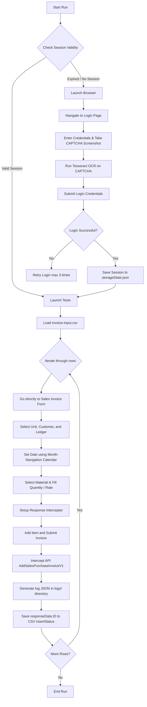

# Step-by-Step Invoice Automation Framework Guide

This document provides a comprehensive, step-by-step explanation of the Sales Invoice Automation framework built using Playwright and TypeScript. The automation script processes CSV data of invoices, logs into the dairy management system, and inputs the invoices sequentially.

---

## 🏗️ Architectural Flow

Here is a high-level flowchart showing how the automation runs from execution start to final invoice entry:

---

## 📂 Project Structure

- [tsconfig.json](file:///d:/UBUNTU%20DATA/Automation/ProjectDataEntry/InvoiceAutomation/tsconfig.json): TypeScript compilation parameters configured for Playwright and Node environments.
- [playwright.config.ts](file:///d:/UBUNTU%20DATA/Automation/ProjectDataEntry/InvoiceAutomation/playwright.config.ts): The main Playwright configuration, pointing to the global setup hook and defining test execution boundaries.
- [global-setup.ts](file:///d:/UBUNTU%20DATA/Automation/ProjectDataEntry/InvoiceAutomation/global-setup.ts): Handles session authentication check and login automation before any test runs.
- [tests/helpers/auth.ts](file:///d:/UBUNTU%20DATA/Automation/ProjectDataEntry/InvoiceAutomation/tests/helpers/auth.ts): Authentication actions, credential extraction, and OCR-based CAPTCHA solving logic.
- [DataDriven/invoice-input.csv](file:///d:/UBUNTU%20DATA/Automation/ProjectDataEntry/InvoiceAutomation/DataDriven/invoice-input.csv): The data source table containing raw invoice parameters and tracking `insertStatus`.
- [tests/saleInvoice.spec.ts](file:///d:/UBUNTU%20DATA/Automation/ProjectDataEntry/InvoiceAutomation/tests/saleInvoice.spec.ts): The core automation test script that inputs each row from the CSV.
- `logs/`: Directory where detailed log files (`invoice_row_1.json`, etc.) are written, storing the exact request headers & payload and response headers & body for the invoice submission API call.

---

## 🛠️ Step-by-Step Workflow Explanation

### Step 1: Initialization & Environment Variables
The framework requires environment credentials to access the dairy system. These are loaded from system environment variables:
- `HITECH_USERNAME`: Username for hitechdairy.in
- `HITECH_PASSWORD`: Password for hitechdairy.in

### Step 2: Session Checking & Persistence (`global-setup.ts`)
Instead of logging in before every test case (which is slow and rate-limits the OCR/CAPTCHA solver), a global setup hook runs first:
1. It looks for an existing session saved in [storageState.json](file:///d:/UBUNTU%20DATA/Automation/ProjectDataEntry/InvoiceAutomation/storageState.json).
2. If found, it launches a headless browser, attempts to visit the protected **Sales Invoice List** page, and checks if the "Add Sales Invoice" button is visible.
3. If the button is visible, the session is active. It skips login and starts the tests immediately.
4. If the login page is shown instead, or if the file does not exist, it proceeds to the login workflow.

### Step 3: Login & Automated OCR CAPTCHA Solving (`tests/helpers/auth.ts`)
When a login is required:
1. **Navigate**: Opens `https://hitechdairy.in/login`.
2. **Credentials**: Fills the username and password fields using locators.
3. **Capture CAPTCHA**: Locates the `#captcha1` canvas element and takes a local screenshot saved as `captcha.png`.
4. **OCR Solving**: Uses `tesseract.js` to process the screenshot. The OCR output is cleaned of special characters and trimmed, then filled into the CAPTCHA textbox.
5. **Validation**: Clicks "Login" and waits 3 seconds. It validates that the URL has successfully redirected to the dashboard (i.e. contains `account-finance`).
6. **Retries**: If it fails (due to incorrect OCR output), it retries up to 3 times before throwing an error.
7. **Save**: Once successful, it saves the session state to `storageState.json`.

### Step 4: CSV Data Fetching & Parsing (`tests/saleInvoice.spec.ts`)
1. Reads [invoice-input.csv](file:///d:/UBUNTU%20DATA/Automation/ProjectDataEntry/InvoiceAutomation/DataDriven/invoice-input.csv) containing fields like `unitName`, `partyName`, `invoiceDate`, `materialName`, `quantity`, and `rate`.
2. A custom CSV line parser handles quoted cells, ensuring commas within material names (e.g., `"Cheese, 100gm"`) do not break parsing.
3. The dataset is formatted into TypeScript objects.

### Step 5: Test Parameter Loop & Datepicker Calendar Navigation
The script loops over each row in the CSV and spawns a Playwright test. For each row:
1. **Direct Navigation**: Navigates directly to the Sales Invoice creation form at `https://hitechdairy.in/account-finance/transactions/sales-invoice` instead of navigating to the list first.
2. **Dropdown Selection**: Uses a custom helper `selectVisibleOptionWithSearch` to click the Material/Unit/Party fields, type the query, and select the matching dropdown item.
3. **Calendar Navigation (`setSalesInvoiceDate`)**:
   - Dates in the CSV (e.g., `02.04.2026`) are converted to the format expected by the date field (`DD/MM/YYYY`).
   - The script opens the Angular Material calendar popup.
   - It calculates the difference in months between the current calendar month and the target month.
   - It clicks the "Next month" or "Previous month" buttons iteratively until it arrives at the target month.
   - It selects the specific day number from the calendar cells.
4. **Material & Pricing**:
   - Inputs the material code and selects it.
   - Fills the `Quantity` and `Rate` textboxes.
5. **API Response Interception, Logging & Submission**:
   - Sets up a network response listener to await responses from `SalesPurchaseInvoice/AddSalesPurchaseInvoiceV1`.
   - Clicks the `add` action button to append the line item to the invoice table, and accepts the confirmation dialog ("Yes").
   - Clicks **Submit** to finalize the transaction.
   - Awaits the API response.
   - Intercepts the HTTP request payload/headers and the response status/headers/body.
   - Writes a comprehensive JSON log file inside the `logs/` directory for that row.
   - Extracts the generated invoice primary key/ID (`responseData`), and updates the corresponding row's `insertStatus` column inside the CSV file.
   - Verifies redirection back to the invoice listing page.
